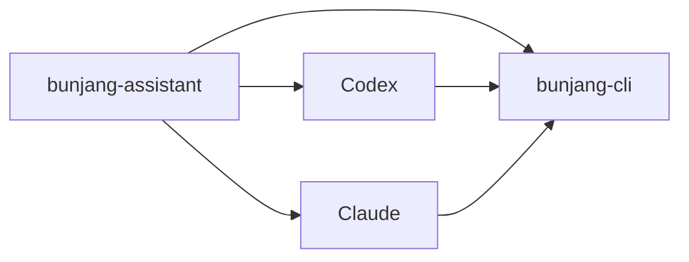

# bunjang-assistant

번개장터 운영을 로컬 Mac에서 Codex, Claude 등 AI 에이전트와 함께 처리하기 위한 AI 툴킷입니다.

이 저장소는 번개장터 운영을 AI 에이전트와 함께 처리하기 위한 로컬 툴킷입니다. `bunjang-cli` 자체를 대체하지 않고, AI 실행 표면 메타데이터, 설치 헬퍼, 단일 공개 스킬, 그리고 `bunjang-cli`를 안전하게 호출하는 Node 래퍼를 제공합니다.



## 지원 범위

- macOS Intel, Apple Silicon
- Codex, Claude 등
- 로컬 개인/소규모 공유 운영

범위 밖:

- Cursor, Claude Desktop MCP bridge, Windows/Linux 설치기
- 호스팅 문서 사이트, 다국어 릴리스, 기업형 승인/스케줄러 흐름
- 자동 최종 구매, 자동 판매글 등록, 계정 설정 변경

## 설치와 검증

```bash
npm install
npm test
```

툴킷 설치기:

```bash
node install/bunjang-assistant-install.mjs --tool cli
node install/bunjang-assistant-install.mjs --tool codex --dry-run
node install/bunjang-assistant-install.mjs --tool claude --dry-run
node install/bunjang-assistant-install.mjs --tool both --dry-run
```

`--tool cli`는 `npm install` 뒤 `npm run bunjang -- auth.status`로 래퍼 준비 상태를 확인합니다. `codex`, `claude`, `both` 설치도 기본적으로 같은 CLI 준비 확인을 먼저 수행하며, 표면 연결만 확인하려면 `--no-install-cli`를 함께 사용합니다.

## 요청 예시

```text
번개장터에서 아이폰 15 128GB 시세 알려줘
번개장터 판매글 작성해줘
/Users/me/sales/balenciaga-3xl 디렉토리 기준으로 판매글 초안 만들어줘
번개장터에 A 디렉토리의 상품들 판매글 작성해
이 매물 상세 확인해줘: 123456
찜했던 상품들 가격 알려줘
```

## CLI 래퍼 실행

```bash
npm run bunjang -- <capabilityId> '<paramsJson>'
```

예시:

```bash
npm run bunjang -- auth.status
npm run bunjang -- search.listings '{"query":"아이폰","maxItems":5}'
npm run bunjang -- agent-search-rank '{"query":"아이폰","maxItems":10}'
npm run bunjang -- item.get '{"listingId":"123456"}'
npm run bunjang -- chat.send '{"threadId":"thread-1","message":"답변입니다."}'
```

`paramsJson`은 생략할 수 있고, 전달하면 JSON 객체여야 합니다.

## 기능 정책

로그인 없이 실행:

- `search.listings`
- `agent-search-rank`
- `item.get`
- `item.list`
- `auth.status`
- `auth.logout`

실행 전 `auth.status` 확인:

- `chat.list`
- `chat.read`
- `chat.start`
- `chat.send`
- `favorite.list`
- `favorite.add`
- `favorite.remove`
- `purchase.prepare`

수동 전용:

- `auth.login`
- `purchase.start`
- `purchase.confirm`
- `account.settings.update`

`src/config.js`가 capability의 기준 파일입니다.

## AI 툴킷 구조

```text
plugin.json
.codex-plugin/plugin.json
.claude-plugin/plugin.json
.claude-plugin/manifest.json
.agents/plugins/marketplace.json

install/
  bunjang-assistant-install.mjs
  install-skills.sh

docs/
  ai-agent-installation.md
  bunjang-assistant.md
  cli-toolkit-integration.md
  skill-installation-and-usage.md
  surface-support-matrix.md

skills/
  bunjang/
    SKILL.md
    docs/
      capability-registry.md
      cli-usage.md
      execution-contract.md
      scenario-playbooks.md
    references/
      ai-context.md
      browser.md
      marketplace.md
      price.md
      routing.md
      sales.md
      search-result-fixture.md
      template.md
      fixtures/
        search-result.json

사용자가 지정한 상품 루트/
  {product-name}/
    image.jpg
    note.md

src/
  config.js
  cli.js
  index.js
```

## 판매글 초안

판매글 작성은 `skills/bunjang/SKILL.md`, `skills/bunjang/references/sales.md`, `skills/bunjang/references/ai-context.md`, `skills/bunjang/references/template.md`를 기준으로 진행합니다.

`/bunjang` 같은 별도 커맨드는 제공하지 않습니다. 사용자는 자연어로 “번장 판매글 작성해줘”, “시세 확인해줘”, “찜했던거 가격 알려줘”처럼 요청하고, 스킬이 필요한 CLI capability를 선택합니다.

상품 루트는 저장소에 고정하지 않습니다. 사용자가 “A 디렉토리의 상품들”처럼 경로를 지정하면 그 디렉토리를 상품 루트로 보고, 바로 아래 상품 디렉토리들을 순서대로 처리합니다. 지정한 디렉토리 자체가 단일 상품 사진과 메모를 담고 있으면 그 디렉토리를 단일 상품 디렉토리로 처리합니다.

자동화는 되돌릴 수 있는 초안 입력까지만 허용합니다. `등록하기`, 최종 구매 확정, 계정 설정 변경은 자동화하지 않습니다.

## 운영 범위

- macOS Intel/Apple Silicon, Codex, Claude 등만 고려합니다.
- Cursor, Claude Desktop MCP 번들, Windows/Linux 설치기, 웹 문서 사이트는 제외합니다.
- 고객/클라이언트 제공용 기업 워크플로가 아니라 개인/소규모 공유 운영용입니다.
- `bunjang-cli`가 제공하지 않는 기능은 툴킷에서 꾸며내지 않습니다.
